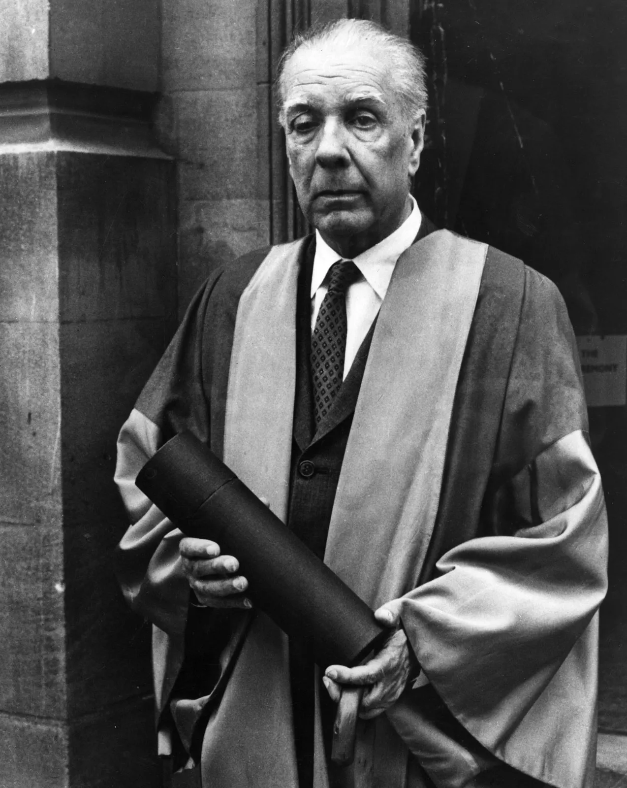
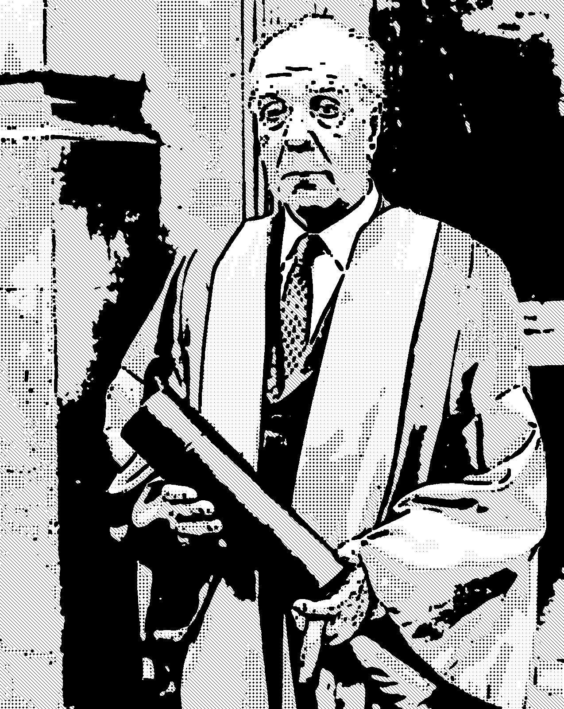
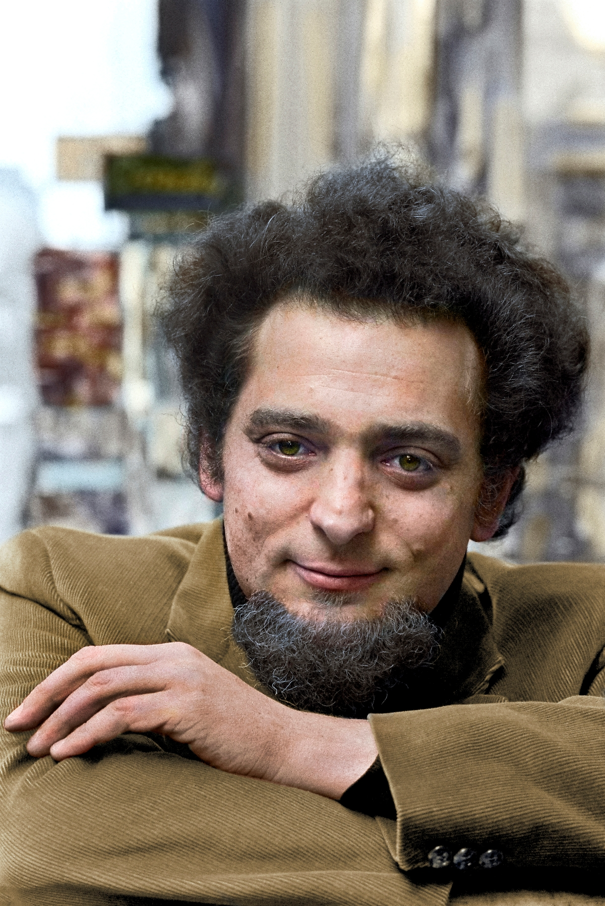
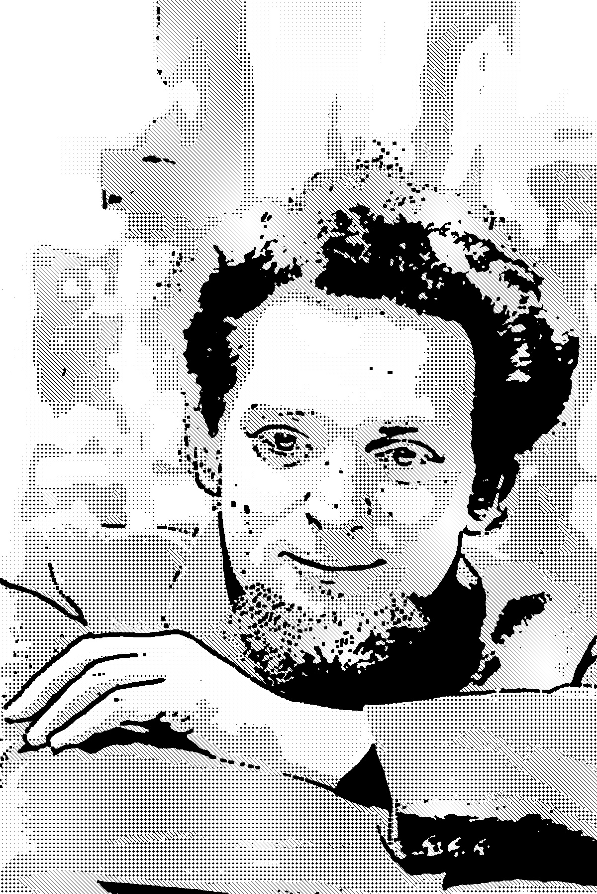
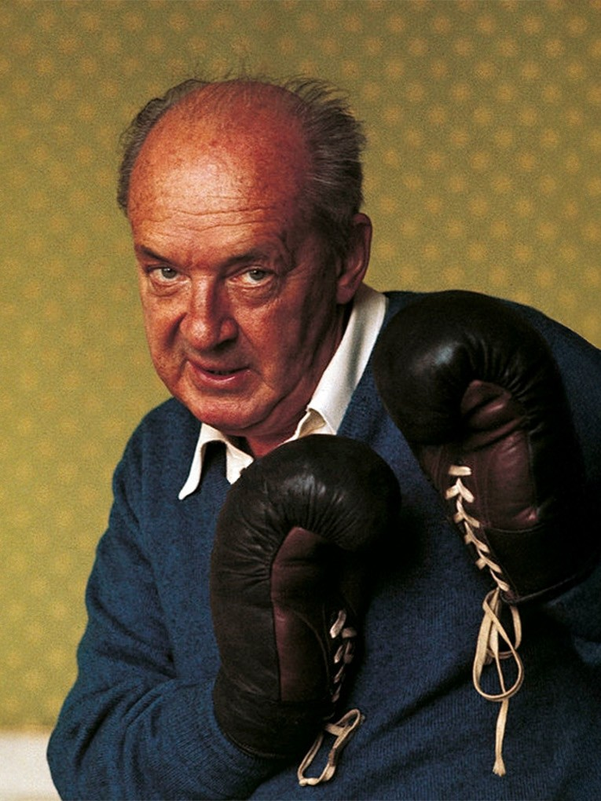
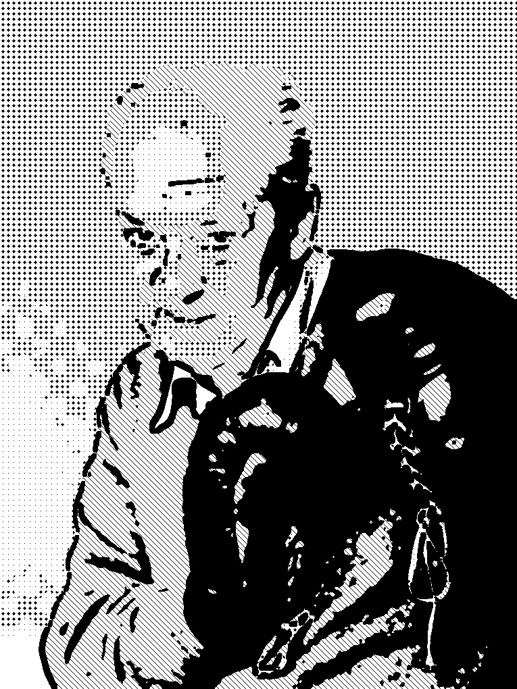
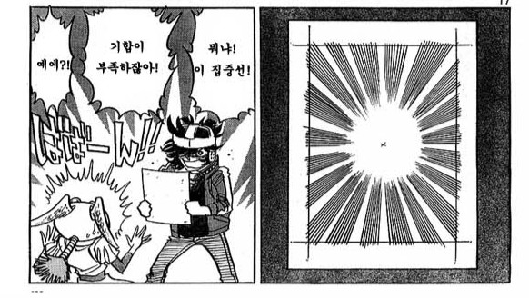

# MangaToneFilter

`OpenCV`를 활용하여 일반 사진을 20세기 스크린톤 쓰던 일본 출판 만화 스타일로 변환하는 이미지 프로세싱 프로젝트

---

## 1. 프로그램 소개

본 프로그램은 딥러닝이나 외부 에셋 없이 순수 컴퓨터비전 기술(`OpenCV`, `Numpy`)만을 사용하여 이미지를 만화 스타일로 렌더링한다.
강의에서 학습한 필터링, 임계처리, 형태학적 연산을 종합적으로 응용한다.

### 사용법
1. `MangaToneFilter.py`파일 다운 후, 다운받은 `MangaToneFilter.py` 폴더 안에 바꾸고 싶은 사진 `test.jpg`을 넣는다.
2. `MangaToneFilter.py` 실행 후 뜨는 이미지를 확인한다.
3. 실행시 뜨는 이미지는, 같은 폴더에 `manga_result.jpg`로 저장된다.

### 활용한 기술

* 대비 강화 및 노이즈 제거 (`cv2.convertScaleAbs`, `cv2.bilateralFilter`): 흑백 경계를 뚜렷하게 하고, 피부 등의 잔주름을 강하게 뭉개어 스크린톤이 깔끔하게 입혀질 수 있도록 전처리한다.

* 외곽선 추출 및 펜 터치 효과 (`cv2.adaptiveThreshold`, `cv2.dilate`): 조명 변화에 강건한 적응형 임계처리로 선을 따고, 형태학적 연산(팽창)을 2회 반복하여 만화 펜으로 꾹 눌러 그린 듯한 굵고 묵직한 윤곽선을 생성한다. 노이즈 선은 중간값 필터(`cv2.medianBlur`)로 제거한다.

* 5단계 톤 분할 및 패턴 타일링 (`cv2.threshold`, `Numpy Tiling`): 밝기 값을 5단계(완전 검정, 45도 사선 빗금, 교차 격자 점, 얇은 점, 완전 하양)로 나누고, `Numpy`를 이용해 직접 생성한 톤 패턴을 마스킹하여 합성한다.

---

## 2. 결과 데모 및 분석

### 2-1. 성공 사례

  
  

* 결과 분석: 학위복을 입은 호르헤 루이스 보르헤스(Jorge Luis Borges)의 사진에서는 만화적 연출이 매우 훌륭하게 적용되었다. 얼굴의 깊은 주름이 `adaptiveThreshold`를 통해 강렬한 펜 터치로 묘사되었으며, 학위복의 명암이 지는 부분에 45도 사선 빗금과 교차 격자 점 패턴이 단계별로 깔끔하게 들어가 실제 출판 만화의 펜화 질감이 성공적으로 구현되었다.

### 2-2. 보통 사례

  
  

* 결과 분석: 조르주 페렉(Georges Perec)의 곱슬머리와 수염 부위가 가장 어두운 톤(0~40) 영역으로 매핑되어 극화체 특유의 흑백 대비를 훌륭하게 보여주며, 옷의 코듀로이 질감 또한 도트 패턴으로 잘 치환되었다. 하지만 얼굴 피부의 미세한 굴곡이나 배경 텍스처가 완전히 평활화되지 않아, 피부 톤과 배경 곳곳에 자잘한 스크린톤 노이즈가 발생했다. 이처럼 장점과 한계가 동시에 나타나 보통 사례로 분류했다.

### 2-3. 실패 사례

  
  

* 결과 분석: 권투 장갑을 낀 블라디미르 나보코프(Vladimir Nabokov)의 이미지에서는 심각한 디테일 붕괴와 노이즈 문제가 발생했다.

* 디테일 소실: 피사체가 착용한 짙은 파란색 스웨터와 어두운 가죽 권투 장갑이 전역 임계처리(Global Thresholding) 과정에서 모두 가장 어두운 영역으로 묶여버렸다. 그 결과 장갑의 질감이나 옷의 주름 형태가 모두 검은색 덩어리로 타버리면서 형체를 알아보기 힘들어졌다.

* 배경 노이즈 증폭: 원본 배경에 있던 패턴이 adaptiveThreshold를 거치면서 자잘한 윤곽선과 스크린톤 찌꺼기로 발현되어 인물에 대한 집중도를 떨어뜨린다.

---

## 3. 한계점 및 개선 방안

### 이미지파일 해상도에 따른 유동적인 스크린톤 효과

* 한계: 8x8 픽셀 크기로 하드코딩된 고정 배열 패턴을 타일링하므로, 입력되는 이미지의 원본 해상도에 따라 스크린톤의 시각적 밀도가 무작위로 달라진다. 고해상도 이미지에서는 점이 너무 작아 단순한 회색 면처럼 보이고, 저해상도에서는 점이 과하게 거칠어 보이는 문제가 있다.

* 개선: 입력 이미지의 해상도(`width`, `height`)에 비례하여 스크린톤 커널의 크기(예: 4x4, 8x8, 16x16)를 동적으로 스케일링하는 로직이 필요하다.

### 배경과 전경의 분리

* `adaptiveThreshold`는 국소적인 대비를 모두 선으로 검출하므로 나보코프의 실패 사례처럼 복잡한 배경이나 텍스처가 있으면 화면 전체가 매우 지저분해진다.

* 렌더링을 일괄 적용하기 전에, 강의에서 다룬 배경 제거 기법이나 `GrabCut` 등의 알고리즘을 활용하여 전경(인물) 마스크를 분리한 뒤, 배경에는 단순한 톤 처리를 하거나 날려버리는 방식의 적용이 필요하다.

### 일본 만화 특유의 효과에 대한 차후 분석 필요

* 본 과제에서는 명암에 따른 톤 분할과 외곽선 강조에 그쳤으나, 실제 일본 출판 만화에서는 감정선이나 상황을 묘사하기 위해 집중선등 훨씬 다양한 비주얼 요소가 사용된다.
  
* 이에 대한 다양한 흑백 일본만화 레퍼런스를 참고하여 분석이 필요하다.
